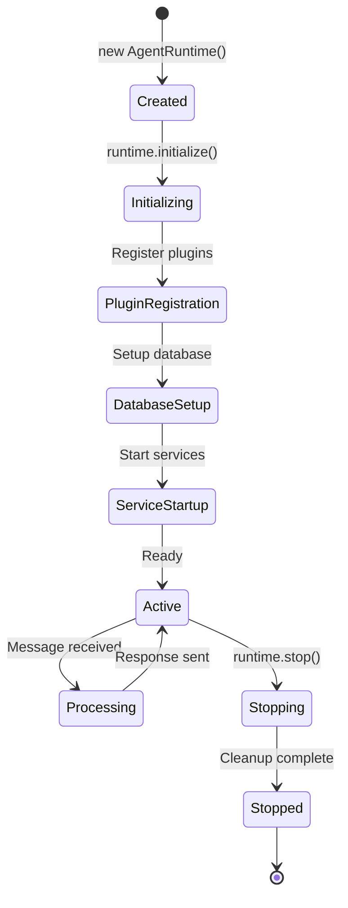

# Agents

Agents are the core operational units in elizaOS. An agent is a running instance of a **Character** configuration, equipped with a runtime environment that enables it to process messages, execute actions, and maintain conversational context.

## Agent vs Character

It's important to understand the distinction:

| Aspect | Character | Agent |
|--------|-----------|-------|
| **Definition** | Blueprint/configuration | Running instance |
| **Lifecycle** | Static (file or object) | Dynamic (created, runs, stops) |
| **Storage** | JSON/TypeScript file | Database record |
| **State** | Stateless | Stateful (has memories, relationships) |
| **Example** | `character.json` | Running bot in Discord |

```typescript
// Character - the blueprint
const character: Character = {
  name: "Assistant",
  bio: ["I am a helpful AI assistant"],
  plugins: ["@elizaos/plugin-openai"]
};

// Agent - the running instance
interface Agent extends Character {
  id: UUID;
  enabled: boolean;
  status: AgentStatus;
  createdAt: number;
  updatedAt: number;
}
```

## Creating an Agent

### Method 1: From Character Object

```typescript
import { AgentRuntime, createCharacter } from "@elizaos/core";
import { sqlPlugin } from "@elizaos/plugin-sql";

const character = createCharacter({
  name: "MyAgent",
  bio: ["An autonomous agent", "Specialized in data analysis"],
  templates: {
    messageHandler: "Analyze the user's message and respond helpfully."
  },
  plugins: ["@elizaos/plugin-openai"],
  settings: {
    OPENAI_API_KEY: process.env.OPENAI_API_KEY
  }
});

const runtime = new AgentRuntime({
  character,
  plugins: [sqlPlugin],
  logLevel: "info"
});

await runtime.initialize();
```

### Method 2: From Character File

```json
// characters/assistant.json
{
  "name": "Assistant",
  "bio": [
    "I am a helpful AI assistant",
    "I can help with various tasks"
  ],
  "messageExamples": [
    [
      {
        "user": "user",
        "content": { "text": "Can you help me?" }
      },
      {
        "user": "Assistant",
        "content": { "text": "Of course! What do you need help with?" }
      }
    ]
  ],
  "topics": ["technology", "science", "programming"],
  "adjectives": ["helpful", "knowledgeable", "patient"],
  "plugins": [
    "@elizaos/plugin-sql",
    "@elizaos/plugin-openai"
  ]
}
```

```typescript
import { parseCharacter } from "@elizaos/core";
import fs from "fs";

const characterData = JSON.parse(
  fs.readFileSync("./characters/assistant.json", "utf-8")
);

const character = parseCharacter(characterData);
const runtime = new AgentRuntime({ character });
```

## Character Configuration

### Core Properties

```typescript
interface Character {
  // Identity
  name?: string;
  username?: string;  // Platform-specific username
  bio?: string[];     // Multi-line biography
  
  // Behavior
  system?: string;    // System prompt override
  templates?: Record<string, string | TemplateFunction>;
  adjectives?: string[];  // Personality traits
  
  // Knowledge & Examples
  messageExamples?: MessageExampleGroup[];
  postExamples?: string[];  // Social media posts
  topics?: string[];        // Topics of interest
  knowledge?: KnowledgeSourceItem[];  // Static knowledge
  
  // Style
  style?: {
    all?: string[];   // General style guides
    chat?: string[];  // Chat-specific style
    post?: string[];  // Post-specific style
  };
  
  // Configuration
  plugins?: string[];  // Plugin names
  settings?: CharacterSettings;
  secrets?: Record<string, string>;
  
  // Features
  advancedPlanning?: boolean;  // Multi-step planning
  advancedMemory?: boolean;    // Long-term memory
}
```

### Message Examples

Message examples help the agent learn conversational patterns:

```typescript
const character: Character = {
  name: "Expert",
  messageExamples: [
    // Example group 1
    {
      examples: [
        {
          user: "user",
          content: { text: "What's machine learning?" }
        },
        {
          user: "Expert",
          content: {
            text: "Machine learning is a subset of AI where computers learn from data without explicit programming."
          }
        },
        {
          user: "user",
          content: { text: "Can you give an example?" }
        },
        {
          user: "Expert",
          content: {
            text: "Sure! Email spam filters learn to identify spam by analyzing thousands of emails you've marked as spam or not spam."
          }
        }
      ]
    },
    // Example group 2
    {
      examples: [
        {
          user: "user",
          content: { text: "How do neural networks work?" }
        },
        {
          user: "Expert",
          content: {
            text: "Neural networks are inspired by the human brain. They consist of layers of interconnected nodes that process information."
          }
        }
      ]
    }
  ]
};
```

### Knowledge Sources

Add static knowledge to your agent:

```typescript
const character: Character = {
  name: "DocExpert",
  knowledge: [
    // Single file
    { item: { case: "path", value: "./docs/guide.md" } },
    
    // Entire directory
    {
      item: {
        case: "directory",
        value: {
          directory: "./docs",
          shared: true  // Available to all agents
        }
      }
    }
  ]
};
```

Knowledge files are automatically:
1. Split into chunks
2. Embedded using the configured embedding model
3. Stored in the database as FRAGMENT memories
4. Retrieved via semantic search when relevant

### Templates

Templates control agent behavior:

```typescript
const character: Character = {
  name: "CustomAgent",
  templates: {
    // String template
    messageHandler: `Analyze the message and respond in character.
    
    Your personality: {{agentName}} - {{adjectives}}
    
    Recent conversation:
    {{recentMessages}}
    
    Current message: {{currentMessage}}
    
    Respond naturally and helpfully.`,
    
    // Function template
    postCreation: ({ state }) => {
      const topics = state.values?.topics || [];
      return `Create a post about: ${topics.join(", ")}`;
    }
  }
};
```

Built-in template variables:
- `{{agentName}}` - Agent's name
- `{{bio}}` - Agent's biography
- `{{adjectives}}` - Personality traits
- `{{topics}}` - Topics of interest
- `{{recentMessages}}` - Conversation history
- Custom variables from providers

### Settings and Secrets

```typescript
const character: Character = {
  name: "SecureAgent",
  settings: {
    // Non-sensitive configuration
    CONVERSATION_LENGTH: 32,
    ACTION_PLANNING: true,
    LLM_MODE: "DEFAULT",
    CHECK_SHOULD_RESPOND: true,
    ENABLE_AUTONOMY: false,
    DISABLE_IMAGE_DESCRIPTION: false
  },
  secrets: {
    // Sensitive credentials (can be encrypted)
    OPENAI_API_KEY: "sk-...",
    ANTHROPIC_API_KEY: "sk-ant-...",
    DISCORD_TOKEN: "..."
  }
};
```

<Accordion title="Setting Precedence">
Settings are resolved in priority order:

1. **Runtime constructor options** (highest)
   ```typescript
   new AgentRuntime({ actionPlanning: false })
   ```

2. **Character settings**
   ```typescript
   { settings: { ACTION_PLANNING: true } }
   ```

3. **Character secrets**
   ```typescript
   { secrets: { API_KEY: "..." } }
   ```

4. **Environment variables** (lowest)
   ```bash
   ACTION_PLANNING=true
   ```
</Accordion>

## Agent Lifecycle



### Initialization

```typescript
const runtime = new AgentRuntime({ character, plugins });

// Initialize (required before use)
await runtime.initialize({
  skipMigrations: false,  // Run database migrations
  allowNoDatabase: false  // Require database adapter
});
```

**Initialization Process:**
1. Register bootstrap plugin (built-in actions/providers)
2. Register advanced planning plugin (if enabled)
3. Register advanced memory plugin (if enabled)
4. Register character plugins
5. Initialize database adapter
6. Run plugin migrations
7. Ensure agent exists in database
8. Create agent's default room
9. Setup embedding dimension

### Message Processing

```typescript
// Process incoming message
const message: Memory = {
  entityId: userId,
  roomId: conversationId,
  content: { text: "Hello, how are you?" },
  metadata: {
    type: MemoryType.MESSAGE,
    timestamp: Date.now(),
    scope: "shared"
  }
};

// Pre-evaluators (can block/rewrite)
const preResult = await runtime.evaluatePre(message);
if (preResult.blocked) {
  console.log("Message blocked:", preResult.reason);
  return;
}

// Store message
const stored = await runtime.createMemory(message);

// Compose state
const state = await runtime.composeState(stored);

// Generate response
const responseText = await runtime.useModel(
  ModelType.TEXT_LARGE,
  {
    prompt: runtime.character.templates?.messageHandler,
    temperature: 0.7
  }
);

// Execute actions
const responses: Memory[] = [];
await runtime.processActions(
  stored,
  responses,
  state,
  async (content) => {
    const response = await runtime.createMemory({
      entityId: runtime.agentId,
      roomId: message.roomId,
      content
    });
    return [response];
  }
);

// Post-evaluators (reflection)
await runtime.evaluate(stored, state, true, undefined, responses);
```

### Cleanup

```typescript
// Stop agent gracefully
await runtime.stop();
```

This stops all services and closes connections.

## Multi-Agent Patterns

### Shared Memory

Agents can share memories in the same room:

```typescript
const agent1 = new AgentRuntime({
  character: character1,
  adapter: sharedAdapter
});

const agent2 = new AgentRuntime({
  character: character2,
  adapter: sharedAdapter  // Same database
});

// Both agents can see messages in shared rooms
const sharedRoomId = "room-123";
```

### Private Memory

Use `agentId` field to make memories private:

```typescript
await runtime.createMemory({
  entityId: userId,
  agentId: runtime.agentId,  // Private to this agent
  roomId: roomId,
  content: { text: "Private note" }
});
```

### Agent Communication

Agents can communicate via shared rooms:

```typescript
// Agent 1 sends message
const msg = await agent1.createMemory({
  entityId: agent1.agentId,
  roomId: sharedRoomId,
  content: { text: "@Agent2 Can you help with this?" }
});

// Agent 2 processes the message
const state = await agent2.composeState(msg);
// ... agent2 responds
```

## Advanced Features

### Action Planning

Enable multi-step action execution:

```typescript
const runtime = new AgentRuntime({
  character: {
    ...character,
    settings: { ACTION_PLANNING: true }
  }
});

// Agent can now plan and execute multiple actions:
// 1. Search for information
// 2. Analyze results
// 3. Generate summary
// 4. Send notification
```

### Advanced Memory

Enable conversation summarization and long-term memory:

```typescript
const character: Character = {
  name: "MemoryAgent",
  advancedMemory: true,  // Enable plugin
  plugins: ["@elizaos/plugin-sql"]
};

const runtime = new AgentRuntime({ character });
await runtime.initialize();

// Automatic features:
// - Conversation summarization
// - Long-term memory extraction
// - Context summary provider
```

### Autonomy Mode

Enable autonomous operation:

```typescript
const runtime = new AgentRuntime({
  character,
  enableAutonomy: true  // Agent can initiate conversations
});

// Agent will:
// - Run background tasks
// - Initiate conversations with admin users
// - Respond to scheduled triggers
```

### Sandbox Mode

Secure multi-tenant deployment:

```typescript
const runtime = new AgentRuntime({
  character,
  sandboxMode: true,  // Secrets are tokenized
  sandboxAuditHandler: (event) => {
    console.log("Token replacement:", event);
  }
});

// runtime.getSetting("API_KEY") returns opaque token
// runtime.fetch() automatically replaces tokens
```

## Performance Tuning

### Conversation Length

```typescript
const runtime = new AgentRuntime({
  conversationLength: 32,  // Messages to include in context
  character
});
```

### LLM Mode

Force model size for cost/quality tradeoff:

```typescript
const runtime = new AgentRuntime({
  llmMode: "SMALL",  // Use small models for all text generation
  character
});
```

Options:
- `DEFAULT` - Use requested model type
- `SMALL` - Force TEXT_SMALL for all calls
- `LARGE` - Force TEXT_LARGE for all calls

### Disable shouldRespond Check

For direct chat interfaces (always respond):

```typescript
const runtime = new AgentRuntime({
  checkShouldRespond: false,  // ChatGPT mode
  character
});
```

## Best Practices

<Accordion title="Agent Design Guidelines">

1. **Keep Characters Focused**
   - Define clear personality and purpose
   - Use specific adjectives and topics
   - Provide relevant examples

2. **Use Settings Appropriately**
   - Store credentials in `secrets`
   - Use `settings` for non-sensitive config
   - Leverage environment variables for deployment

3. **Provide Good Examples**
   - Include diverse conversation scenarios
   - Show desired response style
   - Cover edge cases and error handling

4. **Knowledge Management**
   - Keep knowledge files focused
   - Use directories for related documents
   - Update knowledge when information changes

5. **Performance**
   - Adjust conversation length based on needs
   - Use action planning only when needed
   - Consider LLM mode for cost optimization

6. **Testing**
   - Test with different message types
   - Verify action execution
   - Check memory persistence

</Accordion>

## Next Steps

<CardGroup cols={2}>
  <Card title="Runtime" icon="gears" href="/concepts/runtime">
    Explore runtime capabilities
  </Card>
  <Card title="Plugins" icon="plug" href="/concepts/plugins">
    Build and use plugins
  </Card>
  <Card title="Characters" icon="user" href="/concepts/characters">
    Character configuration deep dive
  </Card>
  <Card title="Memory" icon="brain" href="/concepts/memory-and-state">
    Memory management details
  </Card>
</CardGroup>