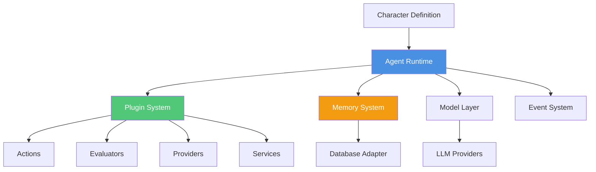
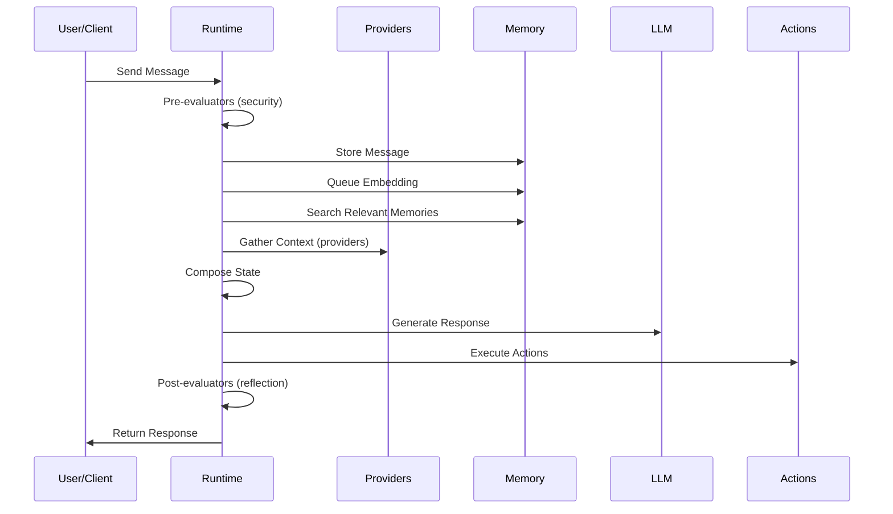

# Architecture Overview

elizaOS is built with a modular, plugin-based architecture that enables flexible development of multi-agent AI applications. The framework consists of several interconnected layers that work together to provide a complete agent runtime environment.

## High-Level Architecture



## Core Layers

### 1. Character Layer

At the foundation is the **Character** definition, which serves as the blueprint for an agent:

```typescript
interface Character {
  name?: string;
  bio?: string[];
  messageExamples?: MessageExampleGroup[];
  postExamples?: string[];
  topics?: string[];
  adjectives?: string[];
  knowledge?: KnowledgeSourceItem[];
  plugins?: string[];
  settings?: CharacterSettings;
  secrets?: Record<string, string>;
  templates?: Record<string, string>;
  advancedPlanning?: boolean;
  advancedMemory?: boolean;
}
```

The Character defines:
- **Identity**: Name, bio, personality traits (adjectives)
- **Knowledge**: Static knowledge sources and examples
- **Behavior**: Templates, message examples, topics of interest
- **Configuration**: Plugin list, settings, and secrets
- **Capabilities**: Feature flags for advanced planning and memory

### 2. Runtime Layer

The **AgentRuntime** is the central orchestration engine:

```typescript
interface IAgentRuntime {
  agentId: UUID;
  character: Character;
  adapter: IDatabaseAdapter;
  
  // Core collections
  actions: Action[];
  evaluators: Evaluator[];
  providers: Provider[];
  plugins: Plugin[];
  services: Map<ServiceTypeName, Service[]>;
  
  // Key methods
  initialize(): Promise<void>;
  processActions(message: Memory, ...): Promise<void>;
  composeState(message: Memory): Promise<State>;
  useModel(modelType: ModelTypeName, params): Promise<Result>;
}
```

**Key Responsibilities:**
- Plugin registration and lifecycle management
- State composition from providers
- Action execution and planning
- Model invocation and routing
- Memory management and retrieval
- Event emission and handling

### 3. Plugin System

Plugins are the primary extension mechanism:

```typescript
interface Plugin {
  name: string;
  description: string;
  
  // Lifecycle
  init?: (config: Record<string, string>, runtime: IAgentRuntime) => Promise<void>;
  
  // Extensions
  actions?: Action[];
  evaluators?: Evaluator[];
  providers?: Provider[];
  services?: ServiceClass[];
  models?: ModelHandlers;
  routes?: Route[];
  events?: PluginEvents;
  
  // Database
  adapter?: IDatabaseAdapter;
  schema?: Record<string, JsonValue>;
  
  // Dependencies
  dependencies?: string[];
  priority?: number;
}
```

<Accordion title="Plugin Registration Flow">
1. **Registration**: `runtime.registerPlugin(plugin)` is called
2. **Initialization**: Plugin's `init()` method is invoked with configuration
3. **Component Registration**: Actions, evaluators, providers are added to runtime
4. **Service Startup**: Service classes are instantiated and started
5. **Model Handlers**: Model handlers are registered with priority
6. **Schema Migration**: Database schemas are applied
7. **Event Handlers**: Event listeners are registered
</Accordion>

### 4. Component Types

#### Actions

Actions are executable capabilities that the agent can perform:

```typescript
interface Action {
  name: string;
  description: string;
  similes?: string[];  // Alternative names
  examples?: ActionExample[][];
  parameters?: ActionParameter[];  // Structured input extraction
  
  validate: (runtime, message, state?) => Promise<boolean>;
  handler: (runtime, message, state?, options?, callback?) => Promise<ActionResult>;
}
```

#### Evaluators

Evaluators run at different phases to assess and transform messages:

```typescript
interface Evaluator {
  name: string;
  description: string;
  phase?: "pre" | "post";  // When to run
  alwaysRun?: boolean;
  
  validate: (runtime, message, state?) => Promise<boolean>;
  handler: (runtime, message, state?, options?, callback?) => Promise<ActionResult>;
}
```

- **Pre-phase** evaluators run before memory storage (security gates, content filtering)
- **Post-phase** evaluators run after response generation (reflection, trust scoring)

#### Providers

Providers inject dynamic context into the agent's state:

```typescript
interface Provider {
  name: string;
  description?: string;
  dynamic?: boolean;  // Conditionally included
  private?: boolean;  // Must be explicitly called
  position?: number;  // Ordering in provider list
  
  get: (runtime, message, state) => Promise<ProviderResult>;
}

interface ProviderResult {
  text?: string;  // Human-readable context
  values?: Record<string, ProviderValue>;  // Template variables
  data?: ProviderDataRecord;  // Structured data
}
```

#### Services

Services provide long-lived functionality:

```typescript
abstract class Service {
  static serviceType: string;
  abstract capabilityDescription: string;
  
  static async start(runtime: IAgentRuntime): Promise<Service>;
  abstract stop(): Promise<void>;
}
```

Common service types:
- `task` - Background task scheduling
- `approval` - Action approval workflows
- `tool_policy` - Action access control
- `transcription` - Audio transcription
- `browser` - Web automation
- `wallet` - Blockchain interactions

### 5. Memory Architecture

Memory is typed and scoped:

```typescript
interface Memory {
  id?: UUID;
  entityId: UUID;  // Who created it
  agentId?: UUID;  // Private to this agent?
  roomId: UUID;    // Conversation context
  content: Content;
  embedding?: number[];
  metadata?: MemoryMetadata;
  sessionId?: string;  // Session filtering
  sessionKey?: string; // Routing key
  createdAt?: number;
}

enum MemoryType {
  MESSAGE = "message",
  DOCUMENT = "document",
  FRAGMENT = "fragment",  // Document chunk
  DESCRIPTION = "description",
  CUSTOM = "custom"
}

type MemoryScope = "shared" | "private" | "room";
```

**Memory Flow:**
1. Message arrives → Pre-evaluators run (can block/rewrite)
2. Message stored with embedding generation queued
3. State composed from relevant memories + providers
4. Response generated and actions executed
5. Post-evaluators run for reflection

### 6. Model Layer

The model layer provides abstraction over different LLM providers:

```typescript
enum ModelType {
  TEXT_SMALL = "text_small",
  TEXT_LARGE = "text_large",
  TEXT_REASONING = "text_reasoning",
  TEXT_EMBEDDING = "text_embedding",
  IMAGE_GENERATION = "image_generation",
  IMAGE_VISION = "image_vision",
  AUDIO_TRANSCRIPTION = "audio_transcription",
  AUDIO_GENERATION = "audio_generation"
}

// Plugins register handlers for model types
runtime.registerModel(
  ModelType.TEXT_LARGE,
  async (runtime, params) => {
    // Call actual provider (OpenAI, Anthropic, etc.)
    return result;
  },
  "plugin-name",
  priority  // Higher priority = preferred
);
```

**Model Selection:**
- Runtime checks for registered handlers by model type
- Highest priority handler is selected
- LLM mode can override model selection:
  - `DEFAULT` - Use requested model type
  - `SMALL` - Force all text generation to use TEXT_SMALL
  - `LARGE` - Force all text generation to use TEXT_LARGE

## Data Flow



## State Composition

The **State** object is the context passed to all components:

```typescript
interface State {
  // Structured data extracted from providers
  values: Record<string, StateValue>;
  
  // Raw provider results
  data: Record<string, ProviderDataRecord>;
  
  // Combined text for prompt inclusion
  text: string;
  
  // Recent conversation history
  recentMessagesData?: Memory[];
  
  // Additional context
  [key: string]: unknown;
}
```

**Composition Process:**
1. Load recent conversation history (respects `conversationLength` setting)
2. Execute static providers (non-dynamic, alwaysRun)
3. Execute dynamic providers (only if relevant keywords detected)
4. Merge results into unified state object
5. Cache state by message ID for reuse

## Configuration Hierarchy

Settings are resolved in order of precedence:

1. **Runtime constructor options** (highest priority)
2. **Character settings** (`character.settings`)
3. **Character secrets** (`character.secrets`)
4. **Environment variables** (lowest priority)

```typescript
// Example setting resolution
const value = runtime.getSetting("API_KEY");
// Checks: character.secrets.API_KEY → character.settings.API_KEY → process.env.API_KEY
```

## Extensibility Points

<Accordion title="How to extend elizaOS">

### 1. Create Custom Actions
```typescript
const myAction: Action = {
  name: "CUSTOM_ACTION",
  description: "Does something custom",
  validate: async (runtime, message) => true,
  handler: async (runtime, message, state) => {
    // Your logic
    return { success: true, text: "Done!" };
  }
};
```

### 2. Build a Plugin
```typescript
export const myPlugin: Plugin = {
  name: "my-plugin",
  description: "Custom functionality",
  actions: [myAction],
  providers: [myProvider],
  services: [MyService],
  init: async (config, runtime) => {
    // Setup logic
  }
};
```

### 3. Implement a Service
```typescript
export class MyService extends Service {
  static serviceType = "my_service";
  capabilityDescription = "Custom service";
  
  static async start(runtime: IAgentRuntime) {
    const instance = new MyService();
    instance.runtime = runtime;
    await instance.initialize();
    return instance;
  }
  
  async stop() {
    // Cleanup
  }
}
```

### 4. Add a Database Adapter
```typescript
class MyAdapter implements IDatabaseAdapter {
  async init() { /* connect to DB */ }
  async createMemory(memory: Memory) { /* store */ }
  async searchMemories(params) { /* vector search */ }
  // ... implement full interface
}

plugin.adapter = new MyAdapter();
```

</Accordion>

## Performance Considerations

### Caching
- **State Cache**: LRU cache with 200 entry limit prevents memory bloat
- **Action Index**: Pre-computed for O(1) action lookup
- **Embedding Queue**: Async generation prevents blocking

### Action Planning

Action planning can be toggled for performance:

```typescript
new AgentRuntime({
  actionPlanning: false  // Single action per response (faster for games)
});
```

### Sandbox Mode

For secure multi-tenant scenarios:

```typescript
new AgentRuntime({
  sandboxMode: true  // Secrets are tokenized, fetch is proxied
});
```

## Next Steps

<CardGroup cols={2}>
  <Card title="Agents" icon="robot" href="/concepts/agents">
    Learn about agent creation and lifecycle
  </Card>
  <Card title="Runtime" icon="gears" href="/concepts/runtime">
    Deep dive into runtime capabilities
  </Card>
  <Card title="Plugins" icon="plug" href="/concepts/plugins">
    Explore the plugin ecosystem
  </Card>
  <Card title="Memory & State" icon="brain" href="/concepts/memory-and-state">
    Understand memory management
  </Card>
</CardGroup>