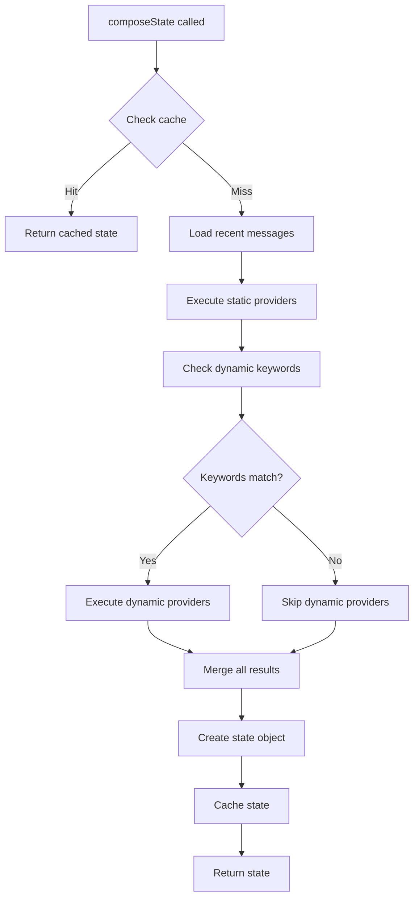

# Memory and State

elizaOS provides a sophisticated memory system for storing conversational context, documents, and agent experiences. The **Memory** system handles long-term storage, while **State** represents the ephemeral context for a single interaction.

## Memory System

### Memory Structure

```typescript
interface Memory {
  id?: UUID;                // Unique identifier
  entityId: UUID;           // Who created this memory
  agentId?: UUID;           // Private to this agent (if set)
  roomId: UUID;             // Conversation/room context
  content: Content;         // The actual content
  embedding?: number[];     // Vector embedding for search
  metadata?: MemoryMetadata;  // Typed metadata
  sessionId?: string;       // Session for filtering
  sessionKey?: string;      // Routing key
  createdAt?: number;       // Timestamp
}

interface Content {
  text?: string;            // Primary text content
  attachments?: Media[];    // Images, files, etc.
  entities?: Entity[];      // Referenced entities
  source?: string;          // Origin ("discord", "telegram", etc.)
  inReplyTo?: string;       // Message being replied to
}
```

### Memory Types

```typescript
enum MemoryType {
  MESSAGE = "message",      // Conversational messages
  DOCUMENT = "document",    // Whole documents
  FRAGMENT = "fragment",    // Document chunks
  DESCRIPTION = "description",  // Entity descriptions
  CUSTOM = "custom"         // Plugin-defined types
}
```

<Accordion title="Memory Type Details">

**MESSAGE**: Standard conversational messages
- User messages
- Agent responses
- System messages
- Most common type

**DOCUMENT**: Complete documents
- Knowledge base articles
- Reference documentation
- Policy documents
- Imported files

**FRAGMENT**: Document chunks for embedding
- Auto-generated from DOCUMENT memories
- ~1000 token chunks
- Used for semantic search
- Links back to parent document

**DESCRIPTION**: Entity descriptions
- User profiles
- Agent descriptions
- Entity summaries
- Relationship context

**CUSTOM**: Plugin-defined types
- Task definitions
- Approval requests
- Custom structured data

</Accordion>

### Memory Scope

```typescript
type MemoryScope = "shared" | "private" | "room";
```

**Shared**: Accessible to all agents in the room
```typescript
await runtime.createMemory({
  entityId: userId,
  roomId: roomId,
  content: { text: "Shared information" },
  metadata: { type: MemoryType.MESSAGE, scope: "shared" }
});
```

**Private**: Only accessible to specific agent
```typescript
await runtime.createMemory({
  entityId: userId,
  agentId: runtime.agentId,  // Private to this agent
  roomId: roomId,
  content: { text: "Private note" },
  metadata: { type: MemoryType.MESSAGE, scope: "private" }
});
```

**Room**: Scoped to specific room/conversation
```typescript
await runtime.createMemory({
  entityId: userId,
  roomId: roomId,
  content: { text: "Room-specific context" },
  metadata: { type: MemoryType.MESSAGE, scope: "room" }
});
```

## Creating Memories

### Basic Memory Creation

```typescript
import { createMessageMemory, MemoryType } from "@elizaos/core";

// Helper function
const memory = createMessageMemory({
  entityId: userId,
  agentId: runtime.agentId,
  roomId: conversationId,
  content: {
    text: "Hello, world!",
    source: "discord"
  }
});

// Store in database
const stored = await runtime.createMemory(memory);
console.log("Memory ID:", stored.id);
```

### Memory with Attachments

```typescript
const memory = await runtime.createMemory({
  entityId: userId,
  roomId: roomId,
  content: {
    text: "Check out this image",
    attachments: [
      {
        url: "https://example.com/image.jpg",
        contentType: ContentType.IMAGE,
        title: "Diagram",
        description: "System architecture diagram"
      }
    ]
  },
  metadata: {
    type: MemoryType.MESSAGE,
    scope: "shared",
    timestamp: Date.now()
  }
});
```

### Document Memory

```typescript
// Create document
const doc = await runtime.createMemory({
  entityId: runtime.agentId,
  roomId: runtime.agentId,
  content: {
    text: fs.readFileSync("./docs/guide.md", "utf-8"),
    source: "filesystem"
  },
  metadata: {
    type: MemoryType.DOCUMENT,
    scope: "shared",
    title: "User Guide",
    documentPath: "./docs/guide.md"
  }
});

// Document is automatically split into fragments
// Fragments are embedded and indexed for search
```

## Searching Memories

### Semantic Search

Use vector embeddings for semantic similarity:

```typescript
// Generate embedding for query
const queryText = "How do I configure the database?";
const embedding = await runtime.useModel(
  ModelType.TEXT_EMBEDDING,
  { text: queryText }
);

// Search memories
const relevantMemories = await runtime.searchMemories({
  roomId: conversationId,
  embedding: embedding as number[],
  match_threshold: 0.8,  // Similarity threshold (0-1)
  match_count: 10,       // Max results
  unique: true           // Deduplicate by content
});

console.log(`Found ${relevantMemories.length} relevant memories`);
relevantMemories.forEach(memory => {
  console.log(memory.content.text?.substring(0, 100));
});
```

### Recent Messages

```typescript
// Get recent conversation
const recentMessages = await runtime.getMemories({
  roomId: conversationId,
  count: 20,
  unique: true  // Remove duplicates
});

// Messages returned in reverse chronological order
recentMessages.reverse();  // Get chronological
```

### Filtered Search

```typescript
// Search with additional filters
const memories = await runtime.searchMemories({
  roomId: conversationId,
  embedding: queryEmbedding,
  match_threshold: 0.8,
  match_count: 10,
  unique: true,
  // Database adapter may support additional filters
  agentId: runtime.agentId,  // Only this agent's memories
  entityId: userId,          // Only from specific user
});
```

## Memory Metadata

Rich metadata for context and filtering:

```typescript
interface MessageMetadata extends MemoryMetadata {
  type: "message";
  
  // Session context
  sessionKey?: string;
  parentSessionKey?: string;
  
  // Sender information
  sender?: {
    id?: string;
    name?: string;
    username?: string;
  };
  
  // Platform context
  provider?: string;  // "telegram", "discord", etc.
  chatType?: "dm" | "group" | "channel";
  
  // Thread context
  thread?: {
    id?: string;
    label?: string;
  };
  
  // Group context
  group?: {
    id?: string;
    name?: string;
    channel?: string;
  };
  
  // Reply context
  reply?: {
    id?: string;
    body?: string;
    sender?: string;
  };
  
  // Platform-specific
  telegram?: {
    chatId?: string | number;
    messageId?: string;
  };
  
  discord?: {
    guildId?: string;
    channelId?: string;
    messageId?: string;
  };
  
  // Session state
  session?: {
    sessionId: string;
    sessionKey: string;
    isNewSession: boolean;
    modelOverride?: {
      provider?: string;
      model?: string;
    };
  };
}
```

### Using Metadata

```typescript
// Create memory with rich metadata
const memory = await runtime.createMemory({
  entityId: userId,
  roomId: roomId,
  content: { text: "Message from Discord" },
  metadata: {
    type: MemoryType.MESSAGE,
    scope: "shared",
    timestamp: Date.now(),
    
    provider: "discord",
    chatType: "group",
    
    sender: {
      id: "123456789",
      name: "John Doe",
      username: "johndoe"
    },
    
    discord: {
      guildId: "987654321",
      channelId: "111111111",
      messageId: "222222222"
    },
    
    group: {
      id: "987654321",
      name: "Developer Chat",
      channel: "#general"
    }
  }
});
```

## Embeddings

Vector embeddings enable semantic search.

### Automatic Embedding

Embeddings are generated asynchronously:

```typescript
// Create memory without embedding
const memory = await runtime.createMemory({
  entityId: userId,
  roomId: roomId,
  content: { text: "This will be embedded" }
});

// Embedding is queued automatically
// Generated in background via event handlers
```

### Manual Embedding

Generate embedding immediately:

```typescript
// Generate embedding synchronously
const memoryWithEmbedding = await runtime.addEmbeddingToMemory(memory);
console.log("Embedding dimensions:", memoryWithEmbedding.embedding?.length);

// Update memory with embedding
await runtime.updateMemory({
  id: memory.id!,
  embedding: memoryWithEmbedding.embedding
});
```

### Queue Embedding

```typescript
// Queue for async generation
await runtime.queueEmbeddingGeneration(
  memory,
  "high"  // Priority: "high" | "normal" | "low"
);

// Non-blocking, returns immediately
// Embedding generated by background workers
```

## State Composition

**State** is the ephemeral context for a single interaction, composed from memories and providers.

### State Structure

```typescript
interface State {
  // Structured values from providers
  values: Record<string, StateValue>;
  
  // Raw provider data
  data: Record<string, ProviderDataRecord>;
  
  // Combined text for LLM prompts
  text: string;
  
  // Recent conversation history
  recentMessagesData?: Memory[];
  
  // Additional context
  [key: string]: unknown;
}

type StateValue = 
  | string
  | number
  | boolean
  | null
  | StateValue[]
  | { [key: string]: StateValue };
```

### Composing State

```typescript
const state = await runtime.composeState(message);

console.log("State text:", state.text);
console.log("State values:", state.values);
console.log("Recent messages:", state.recentMessagesData?.length);
```

**State composition process:**



### State with Specific Providers

```typescript
// Include only specific providers
const state = await runtime.composeState(
  message,
  ["time", "userInfo", "recentActions"],  // Include these
  true  // onlyInclude = true (exclude others)
);

// Exclude specific providers
const state2 = await runtime.composeState(
  message,
  ["time"],  // Exclude these
  false  // onlyInclude = false
);
```

### Skip Cache

```typescript
// Force fresh composition
const state = await runtime.composeState(
  message,
  undefined,  // All providers
  false,      // Not only-include
  true        // skipCache = true
);
```

## Providers

Providers inject dynamic context into state.

### Provider Types

**Static Providers**: Always included
```typescript
const timeProvider: Provider = {
  name: "time",
  get: async () => ({
    text: `Current time: ${new Date().toISOString()}`,
    values: {
      timestamp: Date.now(),
      timezone: Intl.DateTimeFormat().resolvedOptions().timeZone
    }
  })
};
```

**Dynamic Providers**: Conditionally included
```typescript
const weatherProvider: Provider = {
  name: "weather",
  dynamic: true,
  relevanceKeywords: ["weather", "temperature", "forecast", "rain"],
  
  get: async (runtime, message) => {
    // Only called if keywords match
    const weather = await fetchWeather();
    return {
      text: `Current weather: ${weather.condition}, ${weather.temp}°C`,
      values: { weather }
    };
  }
};
```

**Private Providers**: Explicit inclusion only
```typescript
const sensitiveProvider: Provider = {
  name: "sensitive",
  private: true,  // Not in default list
  
  get: async () => ({
    text: "Sensitive information",
    values: { secretData: "..." }
  })
};

// Must explicitly request
const state = await runtime.composeState(message, ["sensitive"], true);
```

### Provider Ordering

```typescript
const earlyProvider: Provider = {
  name: "early",
  position: -100,  // Run early
  get: async () => ({ text: "Early context" })
};

const lateProvider: Provider = {
  name: "late",
  position: 100,  // Run late
  get: async () => ({ text: "Late context" })
};

const defaultProvider: Provider = {
  name: "default",
  // position: 0 (default)
  get: async () => ({ text: "Default position" })
};

// Execution order: early (-100) → default (0) → late (100)
```

### Provider Results

```typescript
interface ProviderResult {
  // Human-readable text (appended to state.text)
  text?: string;
  
  // Template variables (merged into state.values)
  values?: Record<string, ProviderValue>;
  
  // Structured data (stored in state.data[providerName])
  data?: ProviderDataRecord;
}

const richProvider: Provider = {
  name: "userProfile",
  get: async (runtime, message) => {
    const entity = await runtime.getEntityById(message.entityId);
    const memories = await runtime.getMemories({
      entityId: message.entityId,
      count: 100
    });
    
    return {
      text: `User: ${entity.names[0]}\nTotal messages: ${memories.length}`,
      
      values: {
        userName: entity.names[0],
        messageCount: memories.length
      },
      
      data: {
        entity,
        recentMemories: memories.slice(0, 10)
      }
    };
  }
};

// In state:
// state.text includes the provider's text
// state.values.userName available for templates
// state.data.userProfile contains full data
```

## Advanced Memory

The advanced memory plugin adds summarization and long-term memory.

### Enabling Advanced Memory

```typescript
const character: Character = {
  name: "Agent",
  advancedMemory: true,  // Load plugin
  plugins: ["@elizaos/plugin-sql", "@elizaos/plugin-openai"]
};

const runtime = new AgentRuntime({ character });
await runtime.initialize();
```

### Features

**Conversation Summarization**
- Automatically summarizes conversations
- Triggered periodically or on long conversations
- Summaries stored as memories
- Used to maintain context over long interactions

**Long-term Memory Extraction**
- Extracts important facts from conversations
- Stores as structured memories
- Retrieved when relevant
- Builds agent's knowledge base

**Context Summary Provider**
- Provides summaries of past conversations
- Injected into state automatically
- Helps maintain long-term context

### Advanced Memory Schema

```typescript
// Conversation summaries
interface ConversationSummary {
  id: UUID;
  roomId: UUID;
  summary: string;
  startTime: number;
  endTime: number;
  messageCount: number;
}

// Long-term memories
interface LongTermMemory {
  id: UUID;
  entityId: UUID;  // Who it's about
  fact: string;    // The extracted fact
  source: UUID;    // Source message ID
  timestamp: number;
  confidence: number;  // 0-1
}
```

## Memory Best Practices

<Accordion title="Memory management guidelines">

### Performance

1. **Use semantic search efficiently**
   - Adjust match_threshold (0.7-0.9 typical)
   - Limit match_count to what you need
   - Use unique flag to deduplicate

2. **Queue embeddings for bulk operations**
   ```typescript
   for (const memory of memories) {
     await runtime.queueEmbeddingGeneration(memory, "normal");
   }
   ```

3. **Cache state appropriately**
   - State cache is automatic (200 entry LRU)
   - Don't compose state multiple times for same message
   - Use skipCache sparingly

4. **Manage conversation length**
   - Adjust based on token budget
   - Use summarization for long conversations
   - Consider conversation length vs. quality tradeoff

### Organization

1. **Use appropriate memory types**
   - MESSAGE for conversations
   - DOCUMENT for knowledge base
   - FRAGMENT for searchable chunks
   - CUSTOM for specialized data

2. **Scope memories correctly**
   - Use "private" for agent-specific notes
   - Use "shared" for collaborative context
   - Use "room" for conversation-specific data

3. **Structure metadata**
   - Include platform context
   - Add session information
   - Store sender details
   - Enable filtering and analysis

4. **Organize knowledge**
   - Split large documents into focused files
   - Use clear, descriptive titles
   - Update when information changes
   - Remove outdated content

### Security

1. **Respect privacy**
   - Use private scope for sensitive data
   - Set agentId for agent-private memories
   - Implement access controls in custom adapters

2. **Sanitize content**
   - Use pre-evaluators for input validation
   - Redact secrets from memory content
   - Filter inappropriate content

3. **Manage retention**
   - Implement memory expiration if needed
   - Archive old conversations
   - Comply with data retention policies

</Accordion>

## Next Steps

<CardGroup cols={2}>
  <Card title="Runtime" icon="gears" href="/concepts/runtime">
    Runtime memory operations
  </Card>
  <Card title="Providers" icon="database" href="/concepts/providers">
    Building context providers
  </Card>
  <Card title="Database" icon="server" href="/concepts/database">
    Custom database adapters
  </Card>
  <Card title="Advanced Memory" icon="brain" href="/guides/advanced-memory">
    Using advanced memory features
  </Card>
</CardGroup>