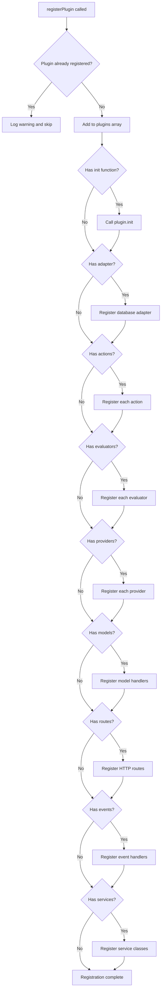

# Plugins

Plugins are the primary mechanism for extending elizaOS functionality. They package related actions, evaluators, providers, services, and models into reusable modules that can be easily shared and composed.

## Plugin Architecture

A plugin is a self-contained module that can register multiple extension points:

```typescript
interface Plugin {
  name: string;                    // Unique identifier
  description: string;             // Human-readable description
  
  // Lifecycle
  init?: (config, runtime) => Promise<void>;
  
  // Components
  actions?: Action[];              // Executable capabilities
  evaluators?: Evaluator[];        // Message processors
  providers?: Provider[];          // Context providers
  services?: ServiceClass[];       // Long-lived services
  routes?: Route[];                // HTTP endpoints
  
  // Models
  models?: {
    [K in ModelTypeName]?: ModelHandler<K>;
  };
  
  // Database
  adapter?: IDatabaseAdapter;      // Database implementation
  schema?: Record<string, JsonValue>;  // Schema definitions
  
  // Events
  events?: PluginEvents;           // Event handlers
  
  // Metadata
  dependencies?: string[];         // Required plugins
  testDependencies?: string[];     // Test-only deps
  priority?: number;               // Model handler priority
  config?: Record<string, string | number | boolean | null>;
}
```

## Creating a Plugin

### Basic Plugin

```typescript
import type { Plugin, Action, Provider } from "@elizaos/core";

const greetAction: Action = {
  name: "GREET",
  description: "Greet the user warmly",
  similes: ["HELLO", "WELCOME"],
  
  validate: async (runtime, message) => {
    const text = message.content.text?.toLowerCase() || "";
    return text.includes("hello") || text.includes("hi");
  },
  
  handler: async (runtime, message, state) => {
    const userName = state.values?.userName || "friend";
    return {
      success: true,
      text: `Hello ${userName}! How can I help you today?`
    };
  }
};

const userInfoProvider: Provider = {
  name: "userInfo",
  description: "Provides user profile information",
  
  get: async (runtime, message, state) => {
    const entity = await runtime.getEntityById(message.entityId);
    return {
      text: `User: ${entity?.names[0] || "Unknown"}`,
      values: {
        userName: entity?.names[0] || "Unknown",
        userId: message.entityId
      }
    };
  }
};

export const greetingPlugin: Plugin = {
  name: "greeting",
  description: "Simple greeting functionality",
  actions: [greetAction],
  providers: [userInfoProvider]
};
```

### Plugin with Initialization

```typescript
export const databasePlugin: Plugin = {
  name: "database",
  description: "Custom database integration",
  
  config: {
    DATABASE_URL: process.env.DATABASE_URL || "sqlite:memory"
  },
  
  init: async (config, runtime) => {
    const dbUrl = config.DATABASE_URL;
    
    // Initialize database connection
    const connection = await connectToDatabase(dbUrl);
    
    // Store connection for use by actions/services
    runtime.setSetting("DB_CONNECTION", connection);
    
    runtime.logger.info(
      { plugin: "database", url: dbUrl },
      "Database initialized"
    );
  },
  
  actions: [queryAction, insertAction],
  services: [DatabaseService]
};
```

### Plugin with Service

```typescript
import { Service } from "@elizaos/core";
import type { IAgentRuntime } from "@elizaos/core";

class WeatherService extends Service {
  static serviceType = "weather" as const;
  capabilityDescription = "Provides weather information";
  
  private apiKey: string;
  private cache = new Map<string, WeatherData>();
  
  static async start(runtime: IAgentRuntime): Promise<WeatherService> {
    const instance = new WeatherService();
    instance.runtime = runtime;
    
    const apiKey = runtime.getSetting("WEATHER_API_KEY");
    if (!apiKey) {
      throw new Error("WEATHER_API_KEY not configured");
    }
    
    instance.apiKey = String(apiKey);
    await instance.initialize();
    return instance;
  }
  
  async initialize() {
    this.runtime.logger.info(
      { service: "weather" },
      "Weather service started"
    );
  }
  
  async getWeather(location: string): Promise<WeatherData> {
    // Check cache
    const cached = this.cache.get(location);
    if (cached && Date.now() - cached.timestamp < 3600000) {
      return cached;
    }
    
    // Fetch from API
    const response = await fetch(
      `https://api.weather.com/v1/location/${location}`,
      {
        headers: { "X-API-Key": this.apiKey }
      }
    );
    
    const data = await response.json();
    
    // Cache result
    this.cache.set(location, { ...data, timestamp: Date.now() });
    
    return data;
  }
  
  async stop() {
    this.cache.clear();
    this.runtime.logger.info(
      { service: "weather" },
      "Weather service stopped"
    );
  }
}

const weatherAction: Action = {
  name: "GET_WEATHER",
  description: "Get weather information for a location",
  
  parameters: [
    {
      name: "location",
      description: "City or location name",
      required: true,
      schema: { type: "string" }
    }
  ],
  
  validate: async () => true,
  
  handler: async (runtime, message, state, options) => {
    const weatherService = runtime.getService<WeatherService>("weather");
    if (!weatherService) {
      return {
        success: false,
        error: "Weather service not available"
      };
    }
    
    const location = options?.parameters?.location as string;
    if (!location) {
      return {
        success: false,
        error: "Location parameter required"
      };
    }
    
    try {
      const weather = await weatherService.getWeather(location);
      return {
        success: true,
        text: `Weather in ${location}: ${weather.condition}, ${weather.temp}°C`,
        data: { weather }
      };
    } catch (error) {
      return {
        success: false,
        error: `Failed to get weather: ${error.message}`
      };
    }
  }
};

export const weatherPlugin: Plugin = {
  name: "weather",
  description: "Weather information plugin",
  services: [WeatherService],
  actions: [weatherAction],
  config: {
    WEATHER_API_KEY: process.env.WEATHER_API_KEY || ""
  }
};
```

### Plugin with Model Handler

```typescript
import { ModelType } from "@elizaos/core";
import type { Plugin } from "@elizaos/core";

export const customLLMPlugin: Plugin = {
  name: "custom-llm",
  description: "Custom LLM provider",
  
  models: {
    [ModelType.TEXT_LARGE]: async (runtime, params) => {
      const { prompt, temperature, maxTokens } = params;
      
      const apiKey = runtime.getSetting("CUSTOM_API_KEY");
      const response = await fetch("https://api.custom-llm.com/v1/generate", {
        method: "POST",
        headers: {
          "Authorization": `Bearer ${apiKey}`,
          "Content-Type": "application/json"
        },
        body: JSON.stringify({
          prompt,
          temperature,
          max_tokens: maxTokens
        })
      });
      
      const data = await response.json();
      return data.text;
    },
    
    [ModelType.TEXT_EMBEDDING]: async (runtime, params) => {
      const { text } = params;
      
      const apiKey = runtime.getSetting("CUSTOM_API_KEY");
      const response = await fetch("https://api.custom-llm.com/v1/embed", {
        method: "POST",
        headers: {
          "Authorization": `Bearer ${apiKey}`,
          "Content-Type": "application/json"
        },
        body: JSON.stringify({ text })
      });
      
      const data = await response.json();
      return data.embedding;
    }
  },
  
  priority: 150  // Higher than default plugins
};
```

## Plugin Registration

Plugins are registered during runtime initialization:

```typescript
import { AgentRuntime } from "@elizaos/core";
import { weatherPlugin } from "./plugins/weather";
import { databasePlugin } from "./plugins/database";

const runtime = new AgentRuntime({
  character: {
    name: "Assistant",
    plugins: [
      "@elizaos/plugin-sql",     // From character config
      "@elizaos/plugin-openai"
    ]
  },
  plugins: [weatherPlugin, databasePlugin]  // Direct instances
});

await runtime.initialize();
```

### Registration Flow



## Plugin Components

### Actions

See [Actions documentation](/concepts/actions) for details.

```typescript
const action: Action = {
  name: "ACTION_NAME",
  description: "What this action does",
  similes: ["ALTERNATIVE_NAME"],
  parameters: [/* parameter definitions */],
  validate: async (runtime, message, state) => boolean,
  handler: async (runtime, message, state, options) => ActionResult,
  priority?: number,
  tags?: string[]
};
```

### Evaluators

```typescript
const evaluator: Evaluator = {
  name: "EVALUATOR_NAME",
  description: "What this evaluator does",
  phase: "pre" | "post",  // When to run
  alwaysRun: boolean,      // Run even if validate returns false
  validate: async (runtime, message, state) => boolean,
  handler: async (runtime, message, state, options) => ActionResult,
  examples: [/* evaluation examples */]
};
```

<Accordion title="Pre vs Post Evaluators">

**Pre-phase evaluators** run before memory storage:
- Use for security checks
- Content filtering
- Rate limiting
- Input validation
- Can block or rewrite messages

```typescript
const securityEvaluator: Evaluator = {
  name: "security_check",
  phase: "pre",
  alwaysRun: true,
  validate: async () => true,
  handler: async (runtime, message) => {
    if (isSpam(message.content.text)) {
      return { blocked: true, reason: "Spam detected" };
    }
    return { blocked: false };
  }
};
```

**Post-phase evaluators** run after response:
- Reflection and analysis
- Trust scoring
- Relationship extraction
- Learning from interactions

```typescript
const reflectionEvaluator: Evaluator = {
  name: "reflection",
  phase: "post",
  validate: async () => true,
  handler: async (runtime, message, state) => {
    // Analyze the conversation
    const insights = analyzeConversation(state);
    // Store insights
    return { success: true };
  }
};
```

</Accordion>

### Providers

```typescript
const provider: Provider = {
  name: "providerName",
  description: "What context this provides",
  dynamic?: boolean,          // Conditionally included
  private?: boolean,          // Must be explicitly requested
  alwaysRun?: boolean,        // Always included
  position?: number,          // Execution order
  relevanceKeywords?: string[],  // For dynamic providers
  
  get: async (runtime, message, state) => {
    return {
      text: "Human-readable context",
      values: { key: "value" },  // Template variables
      data: { structured: "data" }  // Programmatic access
    };
  }
};
```

### Services

```typescript
class MyService extends Service {
  static serviceType = "my_service";
  capabilityDescription = "Service description";
  
  static async start(runtime: IAgentRuntime): Promise<MyService> {
    const instance = new MyService();
    instance.runtime = runtime;
    await instance.initialize();
    return instance;
  }
  
  async initialize() {
    // Setup logic
  }
  
  async stop() {
    // Cleanup logic
  }
}
```

### Routes

Add HTTP endpoints:

```typescript
const plugin: Plugin = {
  name: "api",
  description: "HTTP API endpoints",
  
  routes: [
    {
      type: "GET",
      path: "/status",
      public: true,
      name: "status",
      handler: async (req, res, runtime) => {
        res.json({
          status: "ok",
          agentId: runtime.agentId,
          timestamp: Date.now()
        });
      }
    },
    {
      type: "POST",
      path: "/message",
      public: false,  // Requires authentication
      handler: async (req, res, runtime) => {
        const { text, roomId } = req.body;
        
        const memory = await runtime.createMemory({
          entityId: "user-id",
          roomId,
          content: { text }
        });
        
        res.json({ success: true, memoryId: memory.id });
      }
    }
  ]
};
```

Routes are automatically namespaced: `/{pluginName}{path}`

### Events

```typescript
const plugin: Plugin = {
  name: "events",
  description: "Event handling example",
  
  events: {
    [EventType.MESSAGE]: [
      async (payload: MessagePayload) => {
        console.log("Message received:", payload.message.content.text);
      }
    ],
    
    [EventType.ACTION]: [
      async (payload: ActionEventPayload) => {
        console.log("Action executed:", payload.action);
      }
    ],
    
    "custom:event": [
      async (payload) => {
        console.log("Custom event:", payload);
      }
    ]
  }
};
```

## Database Integration

### Custom Adapter

```typescript
import { IDatabaseAdapter } from "@elizaos/core";

class PostgresAdapter implements IDatabaseAdapter {
  private pool: pg.Pool;
  
  async init() {
    this.pool = new pg.Pool({
      connectionString: process.env.DATABASE_URL
    });
  }
  
  async isReady(): Promise<boolean> {
    try {
      await this.pool.query("SELECT 1");
      return true;
    } catch {
      return false;
    }
  }
  
  async getConnection(): Promise<pg.Pool> {
    return this.pool;
  }
  
  async createMemory(memory: Memory): Promise<boolean> {
    const result = await this.pool.query(
      `INSERT INTO memories (id, entity_id, agent_id, room_id, content, embedding, metadata, created_at)
       VALUES ($1, $2, $3, $4, $5, $6, $7, $8)`,
      [
        memory.id,
        memory.entityId,
        memory.agentId,
        memory.roomId,
        JSON.stringify(memory.content),
        memory.embedding,
        JSON.stringify(memory.metadata),
        memory.createdAt
      ]
    );
    return result.rowCount > 0;
  }
  
  async searchMemories(params: {
    roomId: UUID;
    embedding: number[];
    match_threshold: number;
    match_count: number;
    unique?: boolean;
  }): Promise<Memory[]> {
    // Vector similarity search using pgvector
    const result = await this.pool.query(
      `SELECT * FROM memories
       WHERE room_id = $1
       AND embedding <=> $2 < $3
       ORDER BY embedding <=> $2
       LIMIT $4`,
      [params.roomId, params.embedding, params.match_threshold, params.match_count]
    );
    return result.rows.map(row => this.rowToMemory(row));
  }
  
  // ... implement all IDatabaseAdapter methods
}

export const postgresPlugin: Plugin = {
  name: "postgres",
  description: "PostgreSQL database adapter",
  adapter: new PostgresAdapter()
};
```

### Plugin Schemas

Define database schema for plugin-specific tables:

```typescript
export const myPlugin: Plugin = {
  name: "myplugin",
  description: "Plugin with custom schema",
  
  schema: {
    "user_preferences": {
      columns: {
        id: { type: "uuid", primaryKey: true },
        user_id: { type: "uuid", notNull: true },
        preferences: { type: "jsonb", notNull: true },
        created_at: { type: "bigint", notNull: true }
      },
      indexes: [
        { columns: ["user_id"] }
      ]
    }
  }
};
```

Schemas are automatically migrated during `runtime.initialize()`.

## Plugin Dependencies

### Declaring Dependencies

```typescript
export const advancedPlugin: Plugin = {
  name: "advanced",
  description: "Advanced features",
  dependencies: [
    "@elizaos/plugin-sql",  // Required
    "@elizaos/plugin-openai"
  ],
  
  init: async (config, runtime) => {
    // Dependencies are guaranteed to be loaded
    const sqlPlugin = runtime.plugins.find(p => p.name === "sql");
    // Use SQL plugin features
  }
};
```

### Plugin Loading Order

1. **Bootstrap plugin** (always first)
2. **Advanced planning** (if enabled)
3. **Advanced memory** (if enabled)
4. **Character plugins** (from `character.plugins`)
5. **Explicit plugins** (from runtime constructor)

## Testing Plugins

### Unit Tests

```typescript
import { describe, it, expect, beforeEach } from "vitest";
import { AgentRuntime, createCharacter } from "@elizaos/core";
import { myPlugin } from "./my-plugin";

describe("MyPlugin", () => {
  let runtime: AgentRuntime;
  
  beforeEach(async () => {
    runtime = new AgentRuntime({
      character: createCharacter({ name: "Test" }),
      plugins: [myPlugin]
    });
    await runtime.initialize({ allowNoDatabase: true });
  });
  
  it("should register action", () => {
    const action = runtime.actions.find(a => a.name === "MY_ACTION");
    expect(action).toBeDefined();
  });
  
  it("should execute action", async () => {
    const message = {
      entityId: "user-1",
      roomId: "room-1",
      content: { text: "test message" }
    };
    
    const action = runtime.actions.find(a => a.name === "MY_ACTION");
    const state = await runtime.composeState(message);
    const result = await action.handler(runtime, message, state);
    
    expect(result.success).toBe(true);
  });
});
```

### Integration Tests

```typescript
import { describe, it, expect } from "vitest";
import { TestSuite } from "@elizaos/core";

export const myPluginTests: TestSuite = {
  name: "MyPlugin Integration Tests",
  tests: [
    {
      name: "should handle message flow",
      fn: async (runtime) => {
        const message = await runtime.createMemory({
          entityId: "user-1",
          roomId: runtime.agentId,
          content: { text: "Hello" }
        });
        
        const state = await runtime.composeState(message);
        expect(state.values.myProviderData).toBeDefined();
      }
    }
  ]
};

export const myPlugin: Plugin = {
  name: "myplugin",
  tests: [myPluginTests]
};
```

## Official Plugins

### Core Infrastructure

- **@elizaos/plugin-sql** - SQLite/PostgreSQL database adapter
- **@elizaos/plugin-anthropic** - Claude models
- **@elizaos/plugin-openai** - GPT models
- **@elizaos/plugin-openrouter** - Multi-provider routing
- **@elizaos/plugin-ollama** - Local model support
- **@elizaos/plugin-google-genai** - Gemini models

### Communication Platforms

- **@elizaos/plugin-discord** - Discord bot integration
- **@elizaos/plugin-telegram** - Telegram bot
- **@elizaos/plugin-x** - X (Twitter) integration
- **@elizaos/plugin-slack** - Slack bot

### Capabilities

- **@elizaos/plugin-browser** - Web automation
- **@elizaos/plugin-image-generation** - Image creation
- **@elizaos/plugin-transcription** - Audio-to-text
- **@elizaos/plugin-video** - Video processing
- **@elizaos/plugin-pdf** - PDF handling

### Blockchain

- **@elizaos/plugin-solana** - Solana integration
- **@elizaos/plugin-evm** - Ethereum and EVM chains
- **@elizaos/plugin-tee** - Trusted execution environment

## Publishing Plugins

### NPM Package

```json
// package.json
{
  "name": "@yourorg/eliza-plugin-custom",
  "version": "1.0.0",
  "main": "dist/index.js",
  "types": "dist/index.d.ts",
  "peerDependencies": {
    "@elizaos/core": "^1.0.0"
  },
  "files": [
    "dist"
  ]
}
```

```typescript
// src/index.ts
export { myPlugin } from "./plugin";
export type { MyPluginConfig } from "./types";
```

### Documentation

Include comprehensive documentation:

- **README.md** - Overview and quick start
- **API.md** - Detailed API reference
- **EXAMPLES.md** - Usage examples
- **CHANGELOG.md** - Version history

### Best Practices

<Accordion title="Plugin development guidelines">

1. **Naming**
   - Use descriptive, lowercase names
   - Prefix with organization: `@yourorg/eliza-plugin-name`
   - Be specific: `weather` not `utils`

2. **Configuration**
   - Use environment variables or settings
   - Provide sensible defaults
   - Validate configuration in `init()`

3. **Error Handling**
   - Catch and log errors appropriately
   - Return meaningful error messages
   - Don't crash the runtime

4. **Performance**
   - Avoid blocking operations
   - Use caching where appropriate
   - Clean up resources in service `stop()`

5. **Testing**
   - Write comprehensive unit tests
   - Include integration tests
   - Test error conditions

6. **Documentation**
   - Document all public APIs
   - Provide usage examples
   - Explain configuration options

7. **Versioning**
   - Follow semantic versioning
   - Document breaking changes
   - Maintain backwards compatibility

8. **Dependencies**
   - Minimize external dependencies
   - Use peer dependencies for core packages
   - Keep dependencies updated

</Accordion>

## Next Steps

<CardGroup cols={2}>
  <Card title="Actions" icon="bolt" href="/concepts/actions">
    Build custom actions
  </Card>
  <Card title="Services" icon="server" href="/concepts/services">
    Create services
  </Card>
  <Card title="Runtime" icon="gears" href="/concepts/runtime">
    Runtime integration
  </Card>
  <Card title="Contributing" icon="code-pull-request" href="/contributing">
    Contribute to elizaOS
  </Card>
</CardGroup>