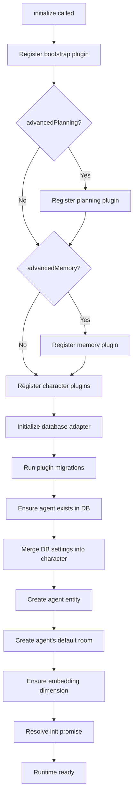

# Runtime

The **AgentRuntime** is the core orchestration engine of elizaOS. It manages the complete lifecycle of an agent, coordinating plugins, services, actions, memory, and model interactions.

## Overview

The runtime is the central hub that:
- Registers and initializes plugins
- Manages service lifecycle
- Composes state from providers
- Routes model inference requests
- Executes actions and evaluators
- Handles memory storage and retrieval
- Emits and listens for events

```typescript
class AgentRuntime implements IAgentRuntime {
  readonly agentId: UUID;
  readonly character: Character;
  adapter: IDatabaseAdapter;
  
  // Component collections
  actions: Action[];
  evaluators: Evaluator[];
  providers: Provider[];
  plugins: Plugin[];
  services: Map<ServiceTypeName, Service[]>;
  models: Map<string, ModelHandler[]>;
  
  // State management
  stateCache: Map<string, State>;
  
  // Features
  readonly sandboxMode: boolean;
  enableAutonomy: boolean;
}
```

## Construction

### Basic Setup

```typescript
import { AgentRuntime } from "@elizaos/core";

const runtime = new AgentRuntime({
  character: myCharacter,
  plugins: [plugin1, plugin2],
  logLevel: "info"
});

await runtime.initialize();
```

### Constructor Options

```typescript
interface RuntimeOptions {
  // Core
  character?: Character;  // If omitted, creates anonymous agent
  agentId?: UUID;         // Override ID generation
  plugins?: Plugin[];
  
  // Database
  adapter?: IDatabaseAdapter;
  
  // Configuration
  settings?: RuntimeSettings;
  conversationLength?: number;  // Messages to include (default: 100)
  
  // Logging
  logLevel?: "trace" | "debug" | "info" | "warn" | "error" | "fatal";
  
  // Capabilities
  disableBasicCapabilities?: boolean;  // Skip core actions/providers
  advancedCapabilities?: boolean;      // Enable advanced features
  
  // Performance
  actionPlanning?: boolean;      // Multi-action execution (default: true)
  llmMode?: LLMModeType;         // Force model size
  checkShouldRespond?: boolean;  // Always respond? (default: true)
  
  // Features
  enableAutonomy?: boolean;  // Autonomous operation
  
  // Security
  sandboxMode?: boolean;              // Secret tokenization
  sandboxTokenManager?: SandboxTokenManager;
  sandboxAuditHandler?: (event: SandboxFetchAuditEvent) => void;
  
  // Advanced
  fetch?: typeof fetch;  // Custom fetch implementation
  allAvailablePlugins?: Plugin[];  // For dependency resolution
}
```

<Accordion title="Anonymous Agents">
When no character is provided, the runtime creates an anonymous agent:

```typescript
const runtime = new AgentRuntime();
// Creates: { name: "Agent-1", bio: ["An anonymous agent"], ... }
```

Anonymous agents:
- Auto-increment counter for unique names
- Skip character provider registration
- Useful for testing or minimal setups
</Accordion>

## Initialization

The `initialize()` method must be called before using the runtime:

```typescript
await runtime.initialize({
  skipMigrations?: boolean;   // Skip database schema updates
  allowNoDatabase?: boolean;  // Allow in-memory adapter
});
```

### Initialization Flow



<Accordion title="What happens during initialization">

1. **Bootstrap Plugin Registration**
   - Core actions: REPLY, IGNORE, NONE
   - Core providers: time, character info
   - Core services: task, approval, action filter

2. **Optional Plugin Registration**
   - Advanced planning (if `character.advancedPlanning === true`)
   - Advanced memory (if `character.advancedMemory === true`)

3. **Character Plugin Registration**
   - Plugins from `character.plugins` array
   - Each plugin's components registered

4. **Database Setup**
   - Adapter initialization (or InMemoryAdapter if allowed)
   - Schema migrations for all loaded plugins

5. **Agent Setup**
   - Agent record created/loaded from database
   - Settings and secrets merged
   - Agent entity created
   - Default room created for agent

6. **Embedding Setup**
   - Detect embedding model dimension
   - Ensure database schema supports it

7. **Service Startup**
   - Services start asynchronously
   - Init promise resolved when ready

</Accordion>

## State Composition

State is the context passed to all components (actions, evaluators, LLM prompts).

### State Structure

```typescript
interface State {
  // Structured values from providers
  values: Record<string, StateValue>;
  
  // Raw provider data
  data: Record<string, ProviderDataRecord>;
  
  // Combined text for prompt inclusion
  text: string;
  
  // Recent conversation messages
  recentMessagesData?: Memory[];
  
  // Additional context
  [key: string]: unknown;
}
```

### Composing State

```typescript
const state = await runtime.composeState(
  message,           // Current message
  ["provider1"],     // Include only these providers (optional)
  false,             // onlyInclude mode (optional)
  false,             // skipCache (optional)
  "trajectory-1"     // Trajectory phase tag (optional)
);
```

**Composition Process:**

1. **Check Cache** - Return cached state if available (keyed by message ID)
2. **Load Recent Messages** - Fetch conversation history (respects `conversationLength`)
3. **Execute Static Providers** - Always-run and non-dynamic providers
4. **Execute Dynamic Providers** - Only if relevant keywords match message
5. **Merge Results** - Combine text, values, and data from all providers
6. **Cache State** - Store in LRU cache (max 200 entries)

### Provider Execution

```typescript
// Provider result structure
interface ProviderResult {
  text?: string;  // Appended to state.text
  values?: Record<string, ProviderValue>;  // Merged into state.values
  data?: ProviderDataRecord;  // Stored in state.data[providerName]
}

// Example provider
const timeProvider: Provider = {
  name: "time",
  get: async (runtime, message, state) => {
    const now = new Date();
    return {
      text: `Current time: ${now.toISOString()}`,
      values: {
        timestamp: now.getTime(),
        timeString: now.toISOString()
      }
    };
  }
};
```

<Accordion title="Provider Ordering">
Providers are executed in this order:

1. **Position-ordered providers** (negative positions first)
2. **Static/alwaysRun providers**
3. **Dynamic providers** (if keywords match)
4. **Position-ordered providers** (positive positions last)

Control provider position:
```typescript
const myProvider: Provider = {
  name: "early",
  position: -100,  // Run early
  get: async () => ({ text: "..." })
};
```
</Accordion>

## Model Usage

The runtime provides model abstraction with automatic routing.

### Model Types

```typescript
enum ModelType {
  TEXT_SMALL = "text_small",           // Fast, cost-effective
  TEXT_LARGE = "text_large",           // High quality
  TEXT_REASONING = "text_reasoning",   // Advanced reasoning
  TEXT_REASONING_LONG = "text_reasoning_long",
  TEXT_EMBEDDING = "text_embedding",   // Vector embeddings
  IMAGE_GENERATION = "image_generation",
  IMAGE_VISION = "image_vision",       // Image understanding
  AUDIO_TRANSCRIPTION = "audio_transcription",
  AUDIO_GENERATION = "audio_generation"
}
```

### Using Models

```typescript
// Text generation (returns string)
const text = await runtime.useModel(
  ModelType.TEXT_LARGE,
  {
    prompt: "Explain quantum computing",
    temperature: 0.7,
    maxTokens: 500
  }
);

// Embeddings (returns number[])
const embedding = await runtime.useModel(
  ModelType.TEXT_EMBEDDING,
  { text: "Hello world" }
);

// Image generation (returns ImageResult)
const image = await runtime.useModel(
  ModelType.IMAGE_GENERATION,
  {
    prompt: "A serene landscape",
    width: 1024,
    height: 1024
  }
);
```

### Model Registration

Plugins register model handlers:

```typescript
runtime.registerModel(
  ModelType.TEXT_LARGE,
  async (runtime, params) => {
    const { prompt, temperature, maxTokens } = params;
    // Call actual provider (OpenAI, Anthropic, etc.)
    const response = await openai.chat.completions.create({
      model: "gpt-4",
      messages: [{ role: "user", content: prompt }],
      temperature,
      max_tokens: maxTokens
    });
    return response.choices[0].message.content;
  },
  "openai",  // Provider name
  100        // Priority (higher = preferred)
);
```

### Model Selection

When multiple handlers are registered for a model type:

1. Handlers are sorted by **priority** (descending)
2. **Highest priority** handler is selected
3. Plugin-specific handler can be requested by provider name

```typescript
// Use highest priority handler
const text1 = await runtime.useModel(ModelType.TEXT_LARGE, params);

// Use specific provider
const text2 = await runtime.useModel(
  ModelType.TEXT_LARGE,
  params,
  "anthropic"  // Force Anthropic provider
);
```

### LLM Mode Override

Force model size globally:

```typescript
const runtime = new AgentRuntime({
  llmMode: "SMALL",  // Override all text generation to TEXT_SMALL
  character
});

// This call will use TEXT_SMALL instead of TEXT_LARGE
const text = await runtime.useModel(ModelType.TEXT_LARGE, params);
```

Options:
- `DEFAULT` - No override
- `SMALL` - Force TEXT_SMALL
- `LARGE` - Force TEXT_LARGE

### Streaming

Streaming is handled via context:

```typescript
import { runWithStreamingContext } from "@elizaos/core";

await runWithStreamingContext(
  {
    onStreamChunk: async (chunk) => {
      process.stdout.write(chunk);
    }
  },
  async () => {
    // Automatically streams if model supports it
    const text = await runtime.useModel(ModelType.TEXT_LARGE, {
      prompt: "Write a story",
      stream: true
    });
  }
);
```

## Action Processing

Actions are the primary way agents perform tasks.

### Action Execution

```typescript
await runtime.processActions(
  message,     // Incoming message
  responses,   // Array to collect responses
  state,       // Composed state
  callback,    // Function to send responses
  {
    onStreamChunk: async (chunk) => {
      // Handle streaming output
    }
  }
);
```

### Action Planning Modes

#### Single Action Mode (Planning Disabled)

```typescript
const runtime = new AgentRuntime({
  actionPlanning: false,
  character
});

// Executes only the first action
// Faster, good for games where state updates frequently
```

**Flow:**
1. Select single action
2. Extract parameters if defined
3. Execute action
4. Return result

#### Multi-Action Mode (Planning Enabled)

```typescript
const runtime = new AgentRuntime({
  actionPlanning: true,  // Default
  character
});

// Can execute multiple actions in sequence
// Good for complex workflows
```

**Flow:**
1. Generate action plan
2. For each action:
   - Extract parameters
   - Execute action
   - Update state with results
3. Return all results

### Action Results

Actions return structured results:

```typescript
interface ActionResult {
  success: boolean;
  text?: string;  // Human-readable description
  values?: Record<string, ProviderValue>;  // State updates
  data?: ProviderDataRecord;  // Structured data
  error?: string | Error;
  continueChain?: boolean;  // Continue to next action
  cleanup?: () => void | Promise<void>;
}
```

Results are:
- Stored in working memory
- Available to subsequent actions
- Merged into state for following steps

### Action Context

Actions receive context about previous executions:

```typescript
interface HandlerOptions {
  actionContext?: ActionContext;
  actionPlan?: ActionPlan;
  parameters?: ActionParameters;  // Extracted parameters
  parameterErrors?: string[];     // Validation errors
  onStreamChunk?: (chunk: string) => Promise<void>;
}

interface ActionContext {
  previousResults: ActionResult[];
  getPreviousResult?: (actionName: string) => ActionResult | undefined;
}
```

Example:
```typescript
const myAction: Action = {
  name: "ANALYZE_RESULTS",
  handler: async (runtime, message, state, options) => {
    // Access previous action results
    const searchResult = options?.actionContext?.getPreviousResult?.("SEARCH");
    
    if (searchResult?.success) {
      const data = searchResult.data;
      // Analyze the search results
    }
    
    return { success: true };
  }
};
```

## Evaluators

Evaluators run at different pipeline phases.

### Pre-Phase Evaluators

Run **before** memory storage (security gates):

```typescript
const contentFilter: Evaluator = {
  name: "content_filter",
  description: "Block inappropriate content",
  phase: "pre",
  alwaysRun: true,
  
  validate: async () => true,  // Always run
  
  handler: async (runtime, message) => {
    const text = message.content.text || "";
    
    if (containsProfanity(text)) {
      return {
        blocked: true,
        reason: "Message contains inappropriate language"
      };
    }
    
    if (containsSecrets(text)) {
      return {
        blocked: false,
        rewrittenText: redactSecrets(text),
        reason: "Redacted sensitive information"
      };
    }
    
    return { blocked: false };
  }
};
```

### Post-Phase Evaluators

Run **after** response generation (reflection):

```typescript
const trustScoring: Evaluator = {
  name: "trust_scoring",
  description: "Evaluate trust in the conversation",
  phase: "post",  // Default
  
  validate: async (runtime, message) => {
    // Only run for specific conditions
    return message.roomId !== runtime.agentId;
  },
  
  handler: async (runtime, message, state) => {
    // Analyze the conversation
    const trustScore = analyzeTrust(state);
    
    // Store as metadata or separate memory
    await runtime.updateMemory({
      id: message.id,
      metadata: {
        ...message.metadata,
        trustScore
      }
    });
    
    return { success: true };
  }
};
```

## Memory Management

### Creating Memories

```typescript
const memory = await runtime.createMemory({
  entityId: userId,
  agentId: runtime.agentId,  // Private to this agent
  roomId: conversationId,
  content: {
    text: "Hello world",
    attachments: []
  },
  metadata: {
    type: MemoryType.MESSAGE,
    scope: "private",
    timestamp: Date.now()
  }
});
```

### Searching Memories

```typescript
// Semantic search
const memories = await runtime.searchMemories({
  roomId: conversationId,
  embedding: queryEmbedding,
  match_threshold: 0.8,
  match_count: 10,
  unique: true
});

// Get recent messages
const recent = await runtime.getMemories({
  roomId: conversationId,
  count: 20,
  unique: true
});
```

### Embedding Generation

Embeddings are generated asynchronously:

```typescript
// Queue embedding generation (non-blocking)
await runtime.queueEmbeddingGeneration(memory, "high");

// Or generate immediately
const withEmbedding = await runtime.addEmbeddingToMemory(memory);
```

### Memory Updates

```typescript
await runtime.updateMemory({
  id: memoryId,
  metadata: {
    ...existingMetadata,
    processed: true
  }
});
```

## Service Management

### Getting Services

```typescript
// Get first service of type
const taskService = runtime.getService<TaskService>("task");

// Get all services of type
const allTaskServices = runtime.getServicesByType<TaskService>("task");

// Check if service exists
if (runtime.hasService("approval")) {
  const approval = runtime.getService<ApprovalService>("approval");
}
```

### Service Loading

Services load asynchronously. Wait for specific service:

```typescript
try {
  const service = await runtime.getServiceLoadPromise("task");
  // Service is ready
} catch (error) {
  console.error("Service failed to load:", error);
}
```

## Event System

The runtime provides an event bus for pub/sub communication.

### Event Types

```typescript
enum EventType {
  MESSAGE = "message",
  ACTION = "action",
  EVALUATOR = "evaluator",
  RUN = "run",
  INVOKE = "invoke",
  ENTITY = "entity",
  WORLD = "world",
  CONTROL = "control"
}
```

### Emitting Events

```typescript
// Emit single event
await runtime.emitEvent(EventType.MESSAGE, {
  entityId: userId,
  roomId: roomId,
  message: memory
});

// Emit to multiple event types
await runtime.emitEvent(
  [EventType.ACTION, EventType.RUN],
  payload
);
```

### Listening for Events

```typescript
// Register event handler
runtime.registerEvent(EventType.MESSAGE, async (payload: MessagePayload) => {
  console.log("Message received:", payload.message.content.text);
});

// Custom event
runtime.registerEvent("custom:event", async (payload) => {
  // Handle custom event
});
```

## Settings Management

### Getting Settings

```typescript
// Get setting (checks secrets, settings, env vars)
const apiKey = runtime.getSetting("OPENAI_API_KEY");

// Returns: string | boolean | number | null
```

Setting resolution order:
1. `character.secrets[key]`
2. `character.settings[key]`
3. `character.settings.extra[key]`
4. `character.settings.secrets[key]`
5. `runtime.settings[key]`
6. `process.env[key]`

### Setting Settings

```typescript
// Set non-secret setting
runtime.setSetting("CONVERSATION_LENGTH", 50);

// Set secret (encrypted storage)
runtime.setSetting("API_KEY", "sk-...", true);
```

### Built-in Settings

| Setting | Type | Default | Description |
|---------|------|---------|-------------|
| `CONVERSATION_LENGTH` | number | 100 | Messages in context |
| `ACTION_PLANNING` | boolean | true | Multi-action execution |
| `LLM_MODE` | string | "DEFAULT" | Force model size |
| `CHECK_SHOULD_RESPOND` | boolean | true | Always respond? |
| `ENABLE_AUTONOMY` | boolean | false | Autonomous operation |
| `DISABLE_IMAGE_DESCRIPTION` | boolean | false | Skip vision analysis |
| `MAX_WORKING_MEMORY_ENTRIES` | number | 50 | Action result cache |

## Run Tracking

Track sequences of related model calls:

```typescript
// Start a run
const runId = runtime.startRun(roomId);

// All model calls and actions are tagged with this runId
const text = await runtime.useModel(ModelType.TEXT_LARGE, params);
await runtime.processActions(message, responses, state);

// End the run
runtime.endRun();

// Get current run ID (creates one if none exists)
const currentRunId = runtime.getCurrentRunId();
```

Run IDs are used for:
- Trajectory logging
- Debugging multi-step operations
- Performance analysis

## Sandbox Mode

Secure secrets in multi-tenant deployments:

```typescript
const runtime = new AgentRuntime({
  sandboxMode: true,
  sandboxAuditHandler: (event) => {
    console.log(`Token ${event.token} ${event.direction}:`, {
      url: event.url,
      location: event.location
    });
  },
  character
});

// Secrets are tokenized
const secret = runtime.getSetting("API_KEY");
// Returns: "__SANDBOX_TOKEN_abc123__" (opaque token)

// Fetch automatically replaces tokens
await runtime.fetch("https://api.example.com", {
  headers: {
    Authorization: `Bearer ${secret}`  // Token replaced with real secret
  }
});
```

**Features:**
- Secrets never exposed to action code
- Tokens replaced at network boundary
- Audit trail of token usage
- Fail-closed mode (error if replacement fails)

## Best Practices

<Accordion title="Runtime optimization tips">

1. **Initialize Once**
   - Create runtime once, reuse for multiple messages
   - Initialization is expensive (plugin loading, DB setup)

2. **Cache State**
   - State caching is automatic (200 entry LRU)
   - Don't compose state multiple times for same message

3. **Use Appropriate Models**
   - TEXT_SMALL for simple tasks
   - TEXT_LARGE for complex reasoning
   - Consider cost vs quality tradeoffs

4. **Action Planning**
   - Disable for frequently updating state (games)
   - Enable for complex workflows

5. **Memory Management**
   - Queue embeddings for bulk operations
   - Use unique flag to deduplicate messages
   - Adjust conversation length based on token budget

6. **Service Dependencies**
   - Await service load promises if critical
   - Handle service failures gracefully

7. **Event Handling**
   - Keep event handlers fast
   - Use events for loose coupling
   - Don't block on event emission

8. **Logging**
   - Use appropriate log levels
   - Room-specific log level overrides available
   - Structured logging for better observability

</Accordion>

## Next Steps

<CardGroup cols={2}>
  <Card title="Actions" icon="bolt" href="/concepts/actions">
    Build custom actions
  </Card>
  <Card title="Plugins" icon="plug" href="/concepts/plugins">
    Create plugins
  </Card>
  <Card title="Memory" icon="brain" href="/concepts/memory-and-state">
    Memory system details
  </Card>
  <Card title="Services" icon="server" href="/concepts/services">
    Service development
  </Card>
</CardGroup>